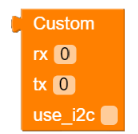

# M5Stack/StickC Wi-SUNモジュール用ブロック

## 使い方

1. `wisun.mpy` をUI FlowのResource Managerからデバイスにダウンロードします。
2. UI FlowのCustom (beta)の下にある`open *.m5b file`から、WiSUN.m5bを開きます。
3. ブロックを使います。

## ブロックの説明

### startブロック

Wi-SUNモジュールを初期化して、通信処理を開始します。

| パラメータ名 | 型 | 説明 |
|:---|:---|:---|
|route_b_id | string | スマート・メーターのBルート接続ID |
|route_b_password | string | スマート・メーターのBルート接続パスワード |
|port_config | dict | Wi-SUNモジュールとの接続設定を含む辞書。後述のconfig系ブロックが返す。 |
|log_debug| bool | デバッグ・ログをコンソールに出力するかどうか。`False` もしくは `True` |

### config_stackブロック

M5Stack Wi-SUNモジュール用の接続設定を返します。 `start`ブロックの`port_config`に指定して使います。

戻り値は `dict` 型です。

### config_hatブロック

M5Stack Wi-SUN HAT用の接続設定を返します。 `start`ブロックの`port_config`に指定して使います。

戻り値は `dict` 型です。

### config_customブロック

BP35A1を使ったカスタム・モジュール用の接続設定を返します。 `start`ブロックの`port_config`に指定して使います。

| パラメータ名 | 型 | 説明 |
|:---|:---|:---|
|rx | int | スマート・メーターのBルート接続ID |
|tx | int | スマート・メーターのBルート接続パスワード |
|use_i2c | bool | I2Cエクスパンダ経由でリセットピンなどを制御するかどうか |

戻り値は `dict` 型です。

### stateブロック

現在のWi-SUNモジュールとスマート・メーターの接続状態を取得します。

戻り値は以下のいずれかの `str` 型の値です。

| 戻り値 | 説明 |
|:---|:---|
|"INITIALIZING"| 初期化処理中 |
|"SCANNING"|Wi-SUNのネットワークを検索中|
|"CONNECTING"|スマート・メーターへの接続処理中|
|"CONNECTED"|スマート・メーターへ接続した|
|"ERROR"|エラーが発生した|
|"UNKNOWN"|不明な状態|

### valuesブロック

現在の状態や測定値を取得します。

戻り値は以下のキーと値を持つ `dict` 型です。

| キー | 値の型 | 説明 |
|:---|:----|:---|
|state|str|現在のスマート・メーターとの接続状態。stateブロックの戻り値と同じ。|
|instant_power|Optional[float]|現在の瞬時電力。値が取得できていない場合はNone|
|cumulative_power|Optional[float]|現在の積算電力量。値が取得できていない場合はNone|
|timestamp|str|値を取得した時刻を表す文字列|

### values_blockedブロック

新しい状態や測定値を取得します。`values`ブロックと異なり、新しい状態に遷移する、もしくは新しい値を取得するまで実行を中断します。

戻り値は `values`ブロックと同じです。

### waitブロック

新しい状態に遷移する、もしくは新しい値を取得するまで実行を中断します。

## サンプル

[examples/wisun](../../examples/wisun) がM5Stack Wi-SUN モジュール用のサンプル・コードです。

