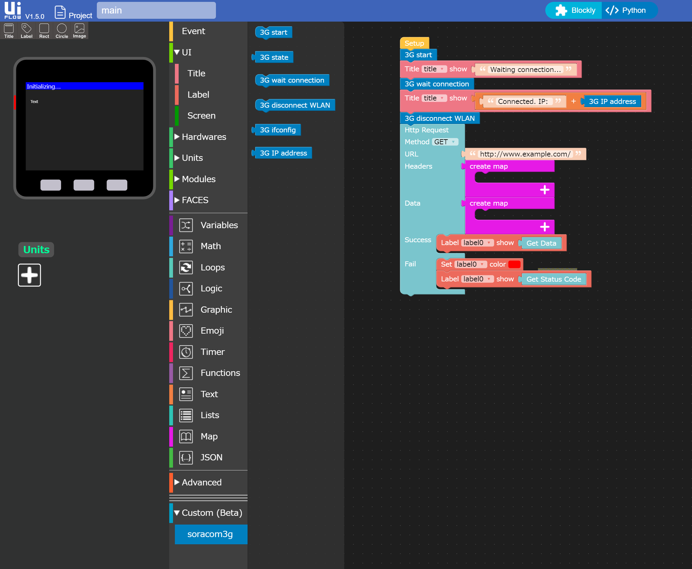

# SORACOM 3Gモジュール・サンプル

## 概要

SORACOM 3Gブロックを使って`www.example.com`の内容を取得して液晶画面に表示するサンプル

</img>

## 動作環境

* UI Flow v1.5.0以降
* SORACOM 3G モジュール

## 使い方

1. `gsm.mpy` をUIFlowのResource Managerでデバイスにダウンロードします。
2. UI FlowのCustom (beta)の下にある`open *.m5b file`から、`blocks/3g/soracom3g.m5b` を開きます。
3. UI Flowで3g.m5fをロードします。

これでサンプル・プログラムは読み込めたはずなので、あとはデバイスにプログラムを転送して実行します。

## SORACOM 3Gブロックの説明

[SORACOM 3Gブロック仕様](../../blocks/3g)
